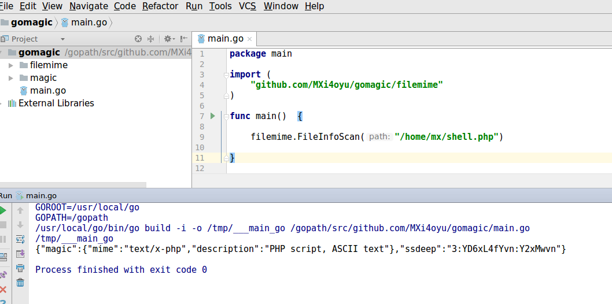

# gomagic 
### 基于libmagic和ssdeep检测文件类型和模糊哈希

# 依赖：
## libmagic
### Debian或Ubuntu: apt-get install libmagic-dev
### RHEL,CentOS或者 Fedora：yum install file-devel
### Mac OS X: brew install libmagic

## ssdeep
### Debian或Ubuntu: apt-get install ssdeep
### RHEL,CentOS或者 Fedora: yum install ssdeep
### Mac OS X: brew install ssdeep

## 运行效果：
